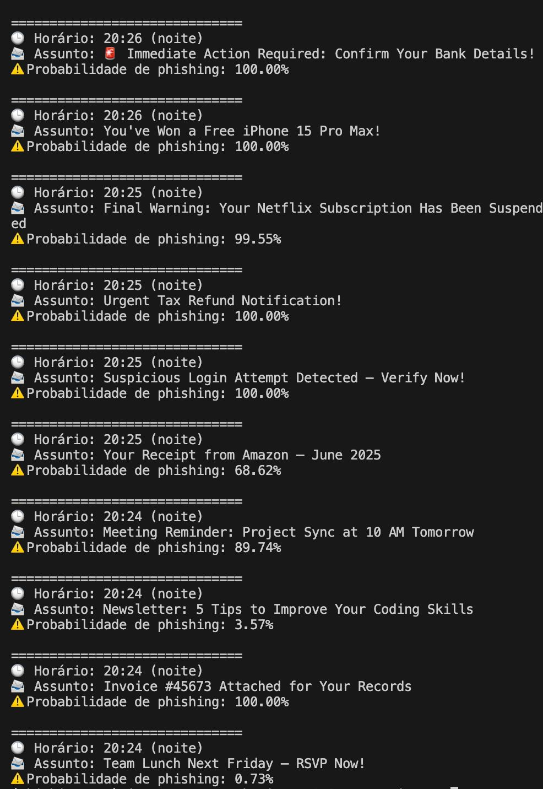

<h1 align="center">
  <b><i>Detecção de Phishing com AutoML</i></b>
</h1>

<br>

## 1. Introdução 💡

Este repositório é dedicado ao desenvolvimento de um modelo que busque atingir um objetivo específico por meio da utilização do *Automated Machine Learning*. Este, se trata de um algoritmo de automatização de etapas técnicas do desenvolvimento de modelos, como pré-processamento, *feature selection*, ajuste de modelo, validação cruzada e seleção de métricas. O framework utilizado para o *AutoML* é o [*PyCaret*](https://pycaret.org), buscando sua simplicidade e integração com bibliotecas [*Python*](https://www.python.org). Para se aprofundar no tema, acesse a nossa [apresentação](presentation/presentation.pdf) sobre *AutoML*.

Inicialmente, este projeto esteve contido no escopo do 5° período do programa de *Trainee* do Capítulo Estudantil do [*Computational Intelligence Society* (*CIS*)](https://cis.ieee.org), vinculado ao [*IEEE*](https://www.ieee.org), na [*Universidade de Brasília* (*UnB*)](https://www.unb.br).

<br>

## 2. Objetivo 🔭

O objetivo atacado pelo [time](#6-equipe-de-desenvolvimento-) foi a detecção de *phishing* em e-mails. Para isso, foi desenvolvido um modelo baseado em *AutoML* que analisa características de URL's, com a finalidade de identificar potenciais ameaças de *phishing*.

<br>

## 3. Estrutura do Projeto 🧱

Abaixo, está definida a estrutura de arquivos do projeto.

```
├── README.md                # Descrição geral do projeto
├── .gitignore               # Arquivos e pastas a serem ignorados pelo Git
├── docker-compose.yml       # Configuração do Docker Compose
├── Dockerfile               # Configuração do ambiente Docker
├── requirements.txt         # Dependências do projeto
├── notebooks/               # Notebooks Jupyter para estudo e experimentação
│   ├── 00_DatasetGeneration.ipynb
│   ├── 01_AutoMLImplementation.ipynb
│   └── ExploratoryAnalysis.ipynb
├── data/                    # Dados utilizados no projeto
│   ├── phishing_dataset_CIS.csv
│   ├── colunas_auxiliares.pkl
│   ├── colunas_treinamento.pkl
│   └── modelo_phishing_final.pkl
├── src/                     # Código-fonte do projeto
│   ├── __init__.py
│   ├── preprocessing.py     # Funções de pré-processamento
│   ├── training.py          # Código para treinamento do modelo
│   ├── inference.py         # Código para inferência com o modelo treinado
│   └── utils.py             # Funções auxiliares
├── tests/                   # Testes automatizados
│   ├── __init__.py
│   ├── test_preprocessing.py
│   ├── test_training.py
│   └── test_inference.py
├── presentation/            # Materiais da apresentação
│   ├── slides.pdf
│   └── notes.md
└── docs/                    # Documentação adicional
    ├── challenges.md
    ├── trends.md
    └── references.md
```

<br>

## 4. Execução do Projeto ⚙

### 4.1. Conhecendo as Dependências

As principais dependências necessárias para a execução do projeto estão listadas a seguir:

- *Python 3.10+*;
- *Pandas*;
- *NumPy*;
- *Scikit-learn*;
- *PyCaret*;
- *BeautifulSoup4*;
- *Docker* (opcional)

### 4.2. Instalação e Execução

Para a instalação e execução do projeto em sua máquina, siga a [*Opção 1*]() ou [*Opção 2*]() a seguir:

#### ► *Opção 1*: Utilizando o **Docker**

1. *Clone* o repositório:
```bash
git clone https://github.com/seu-usuario/CIS-IEE-Project.git
cd CIS-IEE-Project
```

2. *Execute* o projeto com Docker Compose:
```bash
docker-compose up
```

3. *Acesse* o serviço de inferência em http://localhost:8000 ou o ambiente Jupyter em http://localhost:8888.

---

#### ► *Opção 2*: Instalação **Local**

1. *Clone* o repositório:
```bash
git clone https://github.com/seu-usuario/CIS-IEE-Project.git
cd CIS-IEE-Project
```

2. *Crie* e *ative* um ambiente virtual:
```bash
python -m venv venv
source venv/bin/activate  # Linux/Mac
venv\Scripts\activate     # Windows
```

3. *Instale* as dependências:
```bash
pip install -r requirements.txt
```

4. *Execute* os *notebooks* ou *scripts*, caso necessário:
```bash
python -m src.inference  # para executar o serviço de inferência
jupyter notebook notebooks/  # para explorar os notebooks
```

### 4.3. Utilização Prática

Para utilizar o modelo de detecção de *phishing* em seu código, utilize o *script* a seguir:

```python
from src.inference import predict

# URL a ser analisada
url = "http://exemplo.com"

# Realizar a predição
result = predict(url)
print(f"A URL {url} {'é' if result else 'não é'} phishing.")
```

<br>

## 5. Resultados 💻

Abaixo, é possível visualizar um exemplo prático da detecção do modelo com e-mails simulados.



<br>

## 6. Equipe de Desenvolvimento 👥

| [](https://github.com/eduardodpms) | [](https://github.com/Potatoyz908) | [](https://github.com/gdantas04) | [](https://github.com/JMPNascimento) |
|:-:|:-:|:-:|:-:|
| [Eduardo de Pina](https://github.com/eduardodpms) | [Euller Júlio](https://github.com/Potatoyz908) | [Gabriel Dantas](https://github.com/gdantas04) | [João Maurício](https://github.com/JMPNascimento) |